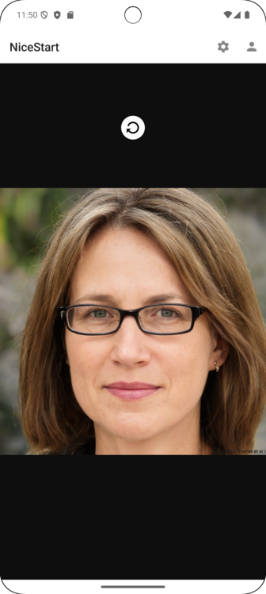
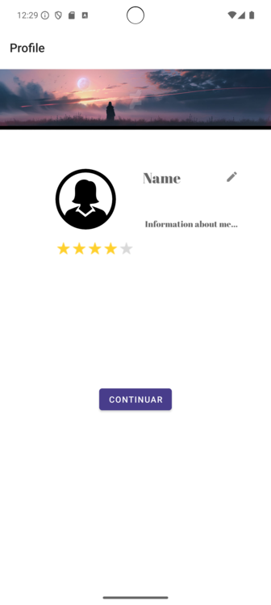
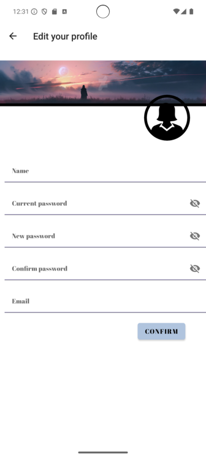

# PROYECTO DE COMIENZO: NICESTART

We have six activities/interactions until now: **SPLASH**, **LOGIN**,  **SIGN UP**, **MAIN**, **PROFILE** and **EDIT PROFILE**. 

## SPLASH: 
Firstly, when opening the app, it shows the splash activity, 
which then will be automatically redirect to Login.

## LOGIN: 

## SIGN UP: 

Both activities are **related**: 

### In login activity: 
    android:onClick="openSignUp"
### Important code to know: 
    public void openSignUp(View view) {
        Intent intent1 = new Intent(Login.this, SignUp.class);
        startActivity(intent1);
    }

## Main: 
In this activity, I am testing some functions as the SnackBar:
    `Snackbar snackbar1 = Snackbar.make(mLayout, "Action is done", Snackbar.LENGTH_SHORT);
    snackbar1.show();`
Toast function, which pops up with some information:
    `Toast.makeText(this, "Item copied", Toast.LENGTH_SHORT).show();`

You can go to your profile by clicking the person icon: 

It looks like this: 

## Profile: 

This activity adds the name you've introduced in the login activity. 
It includes an edit button which sends you to this: 

## Edit profile: 

Each activity has a glide, which can access to an image from the internet, your local file, etc... 
It has some properties. For example, main activity has a profile image which firstly wasn't rounded:

    .load("https://uxwing.com/wp-content/themes/uxwing/download/peoples-avatars/default-profile-picture-female-icon.png")
    .transition(DrawableTransitionOptions.withCrossFade(1000))
    .circleCrop()
    .into(prof);

That's it for now, **we'll be upgrading it!!**
